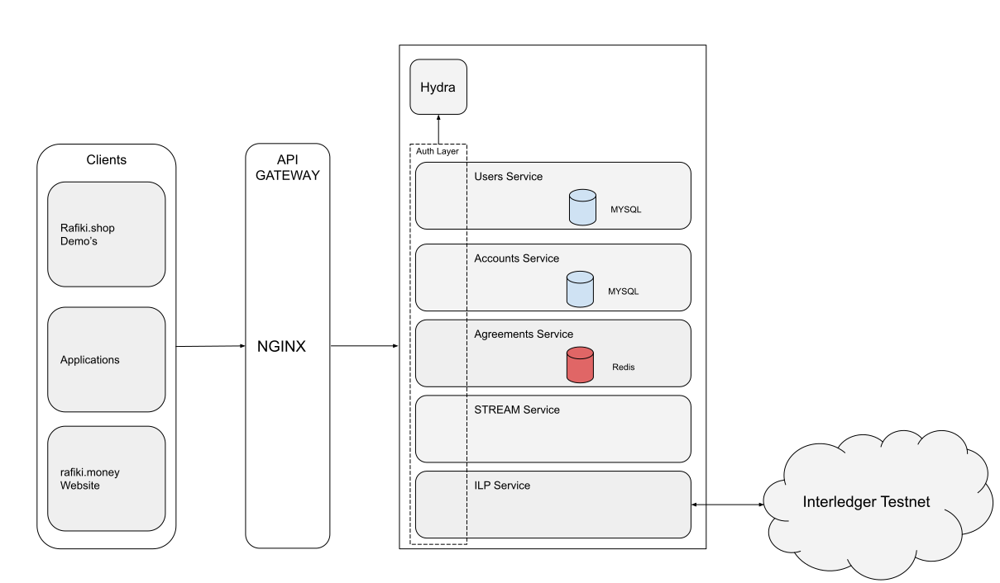
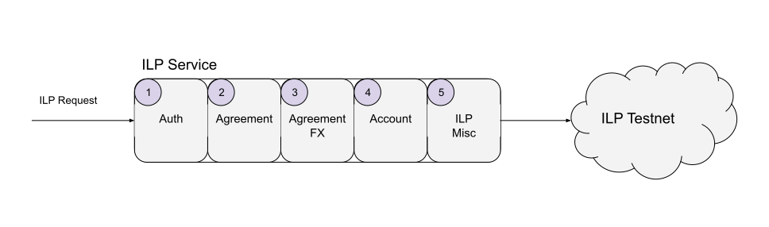

Rafiki Money (RM) has been architected so that components can easily be added, removed and substituted. This was done to 
conform to the goal of providing a reference open-source of a ILP native digital wallet. However existing Wallet Providers are
still able to add ILP features to their current tech stacks in a incremental and non-breaking manner. A full diagram of 
the architecture can be seen below.

## Overview 
All requests to services from external and internal API calls (service to service) are authenticated. As a request comes
into a service, the access token is extracted from the Authorization Header and introspected at the Oauth2 provider (Hydra).
The service then uses the details of the introspected token to make a determination whether the incoming request is
authorization to perform that action. For internal service calls, Client Credential Grant is used to try an ensure a 
Zero Trust network within RM [^1]. 

The core of RM are broken into the follow services:

## Users Service

The users service is the identity provider for Rafiki Money. Its responsible for the following:

* User Identity
* User Signup
* User Login
* User Consent flows
* User Payment Pointers

## Accounts Service
The accounts service is the accounting system for Rafiki Money. Its responsible for the following:

* Account Creation
* Account Management
* Account Balance Tracking

## Agreements Service
All ILP related access is encompassed by a resource known as an Agreement. An
agreement is tied to a specific account. 

The agreement service is also responsible for tracking and enforcing the usage within the limits of the agreement. 
As such when requests flow through the ILP service, it will call out to the Agreement Service to track those balances.

## STREAM Service

## ILP Service
The ILP service is the backbone of RM and 

### 1. Auth

### 2. Agreement

### 3. Agreement FX

### 4. Account

### 5. ILP Misc

## External Services

RM uses a few external/open source services to operate. These are primarily for authentication via oAuth2 and API Gateway
for request routing 

### Hydra (oAuth2 Provider)

[Hydra](https://github.com/ory/hydra) is used as the oAuth provider within Rafiki Money.

### NGINX  (API Gateway)
Nginx acts as the API gateway for RM. All external incoming traffic first gets routed through Nginx which then routes
the requests to the correct downstream services. 

Currently all authentication is handled at the service level and not the API Gateway. This could be revisited at a later
stage as an optimization.

### Interledger Testnet

[^1]: https://cloud.google.com/beyondcorp/
