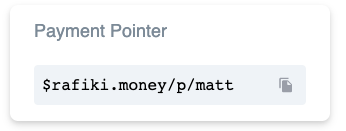

As stated in the [Sending Money Guide](sending.md) , sending and receiving payments on Interledger is a core feature. For this guide we are going to show
you how to receive money into your `Default Account` using your Payment Pointer. In order to simplify the example, we 
are going to send money from another account of ours. Its important to note though that it is not necessary to be your
own account. Anyone on the interledger Testnet can send you money.

Ensure you have created and setup your account as shown in [Getting Started](intro#get-started).

## Setup Another Account
In order to be able to send money to the default account. We need to ensure we have another account with which to send 
the funds from. To create another account:

1. Go to [Rafiki Money Home](https://rafiki.money)
2. Click on **Add Account** 
3. Name the account and click **Create**
4. Click on new account in your list of accounts
5. Click **Add Funds** in the top right hand corner.

## Get your Payment Pointer
To get your Payment Pointer go to [Rafiki Money Home](https://rafiki.money) and you should see

Clicking on the Payment Pointer will automatically copy it to your clipboard.

## Sending
Follow the [Sending Money Guide](sending.md) using your newly created account and instead of using the Interledger 
Payment Pointer, use your own Payment Pointer as gotten above. 

## Checking money was received
Go back to your `Default Account` and in the history of the account you should see the following transaction

## Receiving money from others

In order to receive funds from any others on the Interledger Testnet just provide them with your Payment Pointer.
