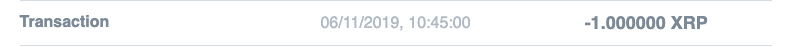

One of the most basic functionalities of Interledger is the ability to send and receive
funds across the network. We are now going to show you how to send money to someone using Rafiki Money
and a Payment Pointer. Ensure you have created and setup your account as shown in [Getting Started](intro#get-started).

## Payment Pointers
Payment Pointers are used for discovery and payment setup within Interledger. You can read more about them 
[here](https://interledger.org/rfcs/0026-payment-pointers/). We are going to send money to the Rafiki Money Interledger account 
Payment Pointer, `$rafiki.money/p/interledger`

## Using the UI
To send a payment via the Dashboard:
1. Go to [Rafiki Money](https://rafiki.money/) and ensure you are logged in.
2. Click on the accounts listed where you would like to send the funds from.
3. Click the **Send** button in the top right corner
4. Enter the Payment Pointer `$rafiki.money/p/interledger` and an amount of `1.0` and click **Send**
5. Once the payment has successfully been sent you will see a confirmation message

You have now successfully sent your first payment on Interledger!

## Checking the amount was sent
You can now refresh your account page and you should see the transaction appear in your account history as below

